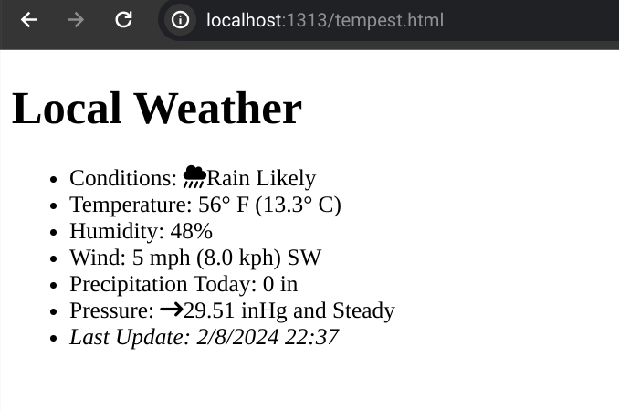
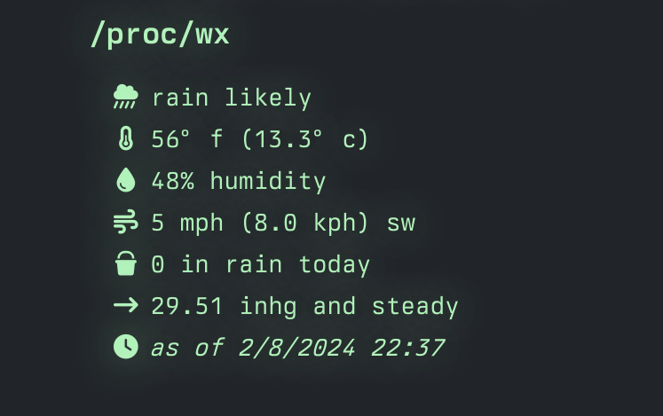

# John's lolz

This repo holds miscellaneous stuff I cobbled together for use with my [omg.lol profile](https://jbowdre.lol) and [associated services](https://home.omg.lol/referred-by/jbowdre).

### (Near) Realtime Weather on profile.lol
I recently saw [Kris's omg.lol profile page](https://kris.omg.lol) with integrated live local weather conditions, and I thought that was exceptionally neat. I immediately wanted to do the same with data from my [Weatherflow Tempest weather station](https://shop.weatherflow.com/products/tempest), but wasn't sure how I could do that without putting my API token in the browser. So I promptly abandoned the idea and moved on to other things.

I later realized that I could use another system to grab data from the authenticated API, and post that somewhere world-readable for the profile page to retrieve it.

So I cobbled together a sort of API proxy: a [simple GitHub Actions workflow](.github/workflows/tempest.yml) that runs every ~5 minutes. It uses secrets stored securely in my GitHub repo to fetch the weather data from the [Weatherflow Tempest API](https://weatherflow.github.io/Tempest/api/), filters for just the current conditions data (not the giant mess of future-forecast details), and posts that to my [paste.lol pastebin](https://paste.jbowdre.lol/tempest.json).

I could then use JavaScript to retrieve the weather details from the pastebin. I cobbled together a [quick local HTML page](tempest.html) for testing as I worked through how to get the data displayed and formatted correctly.

Once I got the scripting sorted out, I was able to easily transfer the script block and relevant spans to [my omg.lol profile page](https://jbowdre.lol) - where I think it looks quite dope, if I do say so myself.

Big thanks to [Kris](https://kris.omg.lol) for the inspiration and examples I needed to get this working.